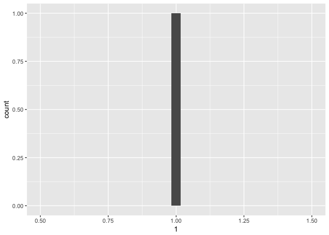

Subtype-aware batch correction retains biological signal of integrated
breast cancer datasets---Supplementary Methods
================
Gil Tomás
<gil.tomas@igmm.ed.ac.uk>

``` r
library(data.table)  # data frame manipulation
library(oligo)  # preprocessing oligonucleotide arrays
library(limma)  # differential expression analysis
library(AIMS)  # implements AIMS classifier (non-parametric version of PAM50)
library(sva)  # implements ComBat
library(ggplot2)  # sophisticated plotting framework
library(ggsignif)  # significance bars for ggplot2
library(irr)  # Cohen's Kappa
library(knitr)  # kable function for tables
library(kableExtra)  # format kable tables
library(SNAGEE)  # quality metric based on signal-to-noise ratio
```

``` r
## Directories
rdsDir <- "../out/rds"
csvDir <- "../data/csv"
dsetDir <- "../data/rds"
libDir <- "../lib"
graphsDir <- "../out/pdf"
hrmnDataDir <- "../eddie/data/out"

## Affy Chips
chips <- c("p2", "a")

## Normalisation Methods
normMths <- c("frma", "mas5", "rma")

## Colours
cols <- c(Basal = "red2", Her2 = "purple", `Luminal B` = "cadetblue2", `Luminal A` = "dodgerblue4", 
    Normal = "forestgreen")

## Seed
set.seed(42)
```

``` r
qplot(1)
```



-&gt;
